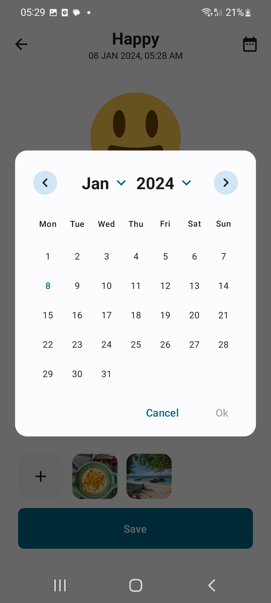
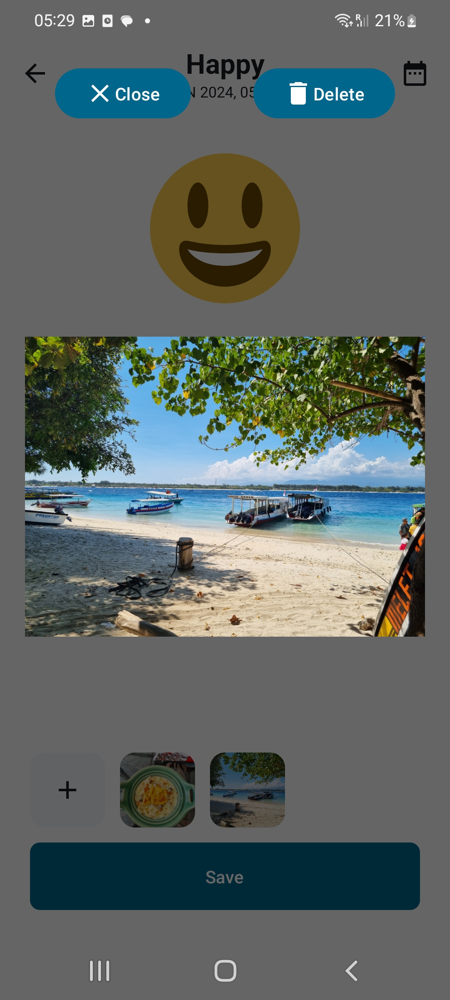
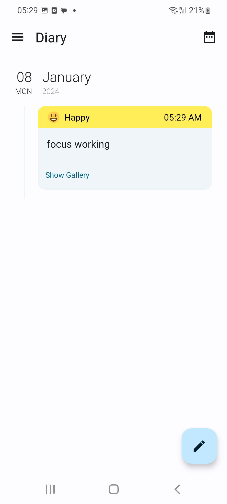
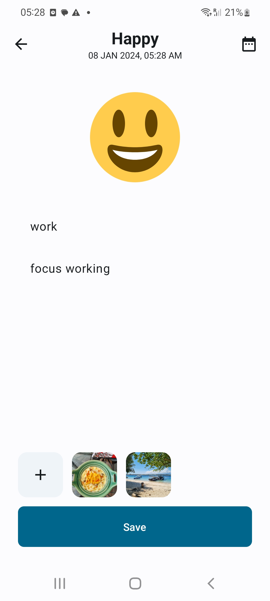

# Cadmus-Diary
A multi-module diary application that allows the user to register diary entries.

## The Brief

The app allows the user to register a description, a mood and images foe each diary entry.
The app we will be able to easily synchronize the data between a client-side database(Android) and a powerful, fully managed back-end in Atlas and also Firebase. 

## Demo

Insira um gif ou um link de alguma demonstração

## Screenshots

Image #1            |  Image #2             |  Image #3     |  Image #4            
:-------------------------:|:----------------------------:|:----------------------------:|:----------------------------:
[App Screenshot](images/CadmusDiary_1.jpg)    |       |    |   

  

## Architecture & Libraries
    - MVI
    - ROOM Database
    - Dependency Injection - Dagger-Hilt
    - Kotlin Coroutines
    - Splash API 
    - Material 3
    - One-Tap Sign in with Google 
    - Firebase Authentication, 
    - Firebase Storage
    - Mongo Authentication, 
    - Mongo Realm Database

